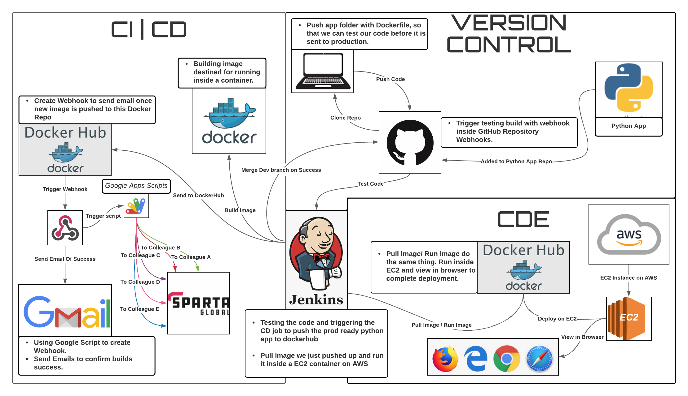

# Python TDD Testing




# Testing Python App :snake:

## Step 1: Prerequisites

- [x] Pycharm IDE
- [x] Python 3.7 /3.8 installed

## Step 2: Clone repo 
Clone the repo and save folders with the required code 

## Step 3: Add new interpreter to the current project 


for more info: https://www.jetbrains.com/help/pycharm/configuring-python-interpreter.html

## Step 4: Make sure you are in the root directory 

- Right click on the project folder in pycharm 
- Select `Open in terminal`

## Step 5: Install plugins/packages 
- Should automatically be picked up by Pycharm when opening the following file : 
```
main.py
```

## Step 6: pip install . 

- run the command `pip install .` in the terminal

## Step 7: Set environment
- Open `config.ini` file and set test environment to `live`
- Click on terminal and run `python -m pytest tests/`


## Step 8: If tests are stil failing check the following things:

### Error when attempting to run pytest


- try to update `pluggy dependency`
- run the following command in terminal
```
pip install -U pluggy

OR

pip3 install -U pluggy
```
- This should solve the issue and tests should now run!

### Test Error 1: Extra row being created when creating csv file 
 
 - need to add `newline=''` (empty string) parameter
 - https://stackoverflow.com/questions/3348460/csv-file-written-with-python-has-blank-lines-between-each-row

 - It should now look like this 
 

### Test Error 2: Inconsistent naming convention in files


- Open `test_html_object_manager.py`
- Ensure to change 
```
HtmlObjectManager 

TO 

HttpManager
````
- This has to be done throughout the whole file!
- It should now look like this 


### Test Error 3: def test_html_manager_returns_html_from_url


- Open `test_html_object_manager.py`
- Go to line 26 and 27 


```
    def test_html_manager_returns_html_from_url(self, html_manager_object):
        assert 'Tracking the IT job market' in html_manager_object.html
```
- Ensure 'Job Market' is capitilized as this is the way it is in site html

- It should now look like this 


## All tests should now pass!!

